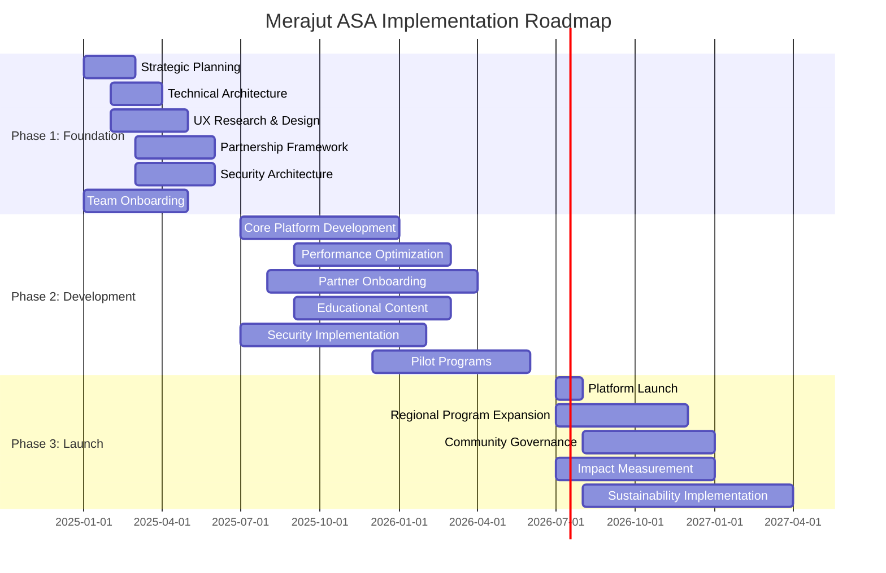

# Executive Summary and Implementation Roadmap

# Executive Summary and Implementation Roadmap

## Overview

This document provides a comprehensive executive summary of the Merajut ASA platform implementation plan and a consolidated roadmap for execution, bringing together all workstreams into a cohesive implementation strategy aligned with the "Gotong Royong Digital" values and "Evolution, Not Revolution" philosophy.

### Project Vision

<aside>

Merajut ASA aims to create a community-centered digital philanthropy platform that rivals the scale of [KitaBisa.com](http://KitaBisa.com) through superior performance, accessibility, and community engagement. The platform will serve as a catalyst for digital transformation in West Java's philanthropic ecosystem while embodying Indonesian values of mutual support and cooperation.

</aside>

## Strategic Implementation Framework

### Core Philosophy

- **Evolution, Not Revolution:** Enhancing existing donation experiences rather than disrupting them
- **Gotong Royong Digital:** Digital extension of traditional Indonesian communal cooperation
- **Performance Excellence:** Technical quality as an enabler of community experience
- **Community-Centered Design:** Platform shaped by and for community needs
- **Sustainable Impact:** Focus on long-term community benefit and platform viability
- **Transparent Governance:** Clear accountability and inclusive decision-making

### Key Differentiators

- **Superior Technical Performance:** <1.5s LCP, >95% WCAG accessibility compliance
- **Community Governance:** Structured community involvement in platform direction
- **Regional Activation:** Targeted approach to West Java (Jabar) communities
- **Digital Capability Building:** Comprehensive educational initiative
- **Integrated Feedback Systems:** "Suara Komunitas" feedback implementation
- **Mentorship Framework:** Structured knowledge sharing and leadership development

## Three-Phase Implementation Approach

<aside>

The Merajut ASA platform will be implemented through a structured three-phase approach:

</aside>

### Phase 1: Strategic Foundation & Design (0-6 Months)

**Budget:** 3.795.000.000 IDR

**Focus:** Strategic positioning, comprehensive research, system architecture planning, design with accessibility and performance focus

**Key Deliverables:**

- Comprehensive strategic and technical architecture blueprints
- User-centered design system with accessibility built-in
- Performance budgets and optimization strategy
- Initial partnership framework and stakeholder mapping
- Security and privacy by design architecture
- Community engagement and feedback system design

### Phase 2: Core Development & Technology (6-18 Months)

**Budget:** 7.500.000.000 IDR (projected)

**Focus:** Platform development, performance optimization, community features implementation, partnership development

**Key Deliverables:**

- Functional platform with performance targets achieved
- Initial partnership network of panti and other organizations
- Community feedback mechanisms and implementation
- Educational resources and mentorship framework
- Security implementation and compliance framework
- Multi-level reporting infrastructure

### Phase 3: Launch, Community Building & Iteration (18+ Months)

**Budget:** 5.000.000.000 IDR (projected)

**Focus:** Community-based launch, comprehensive program implementation, feedback-driven iteration

**Key Deliverables:**

- Full platform launch with complete feature set
- Comprehensive "Katalisator Perubahan Jabar" program
- "Akademi Penggerak Digital" educational initiative
- Community governance implementation
- Impact measurement and sustainability model
- Long-term evolution roadmap

## Critical Success Factors

| **Area** | **Critical Success Factors** | **Key Performance Indicators** |
| --- | --- | --- |
| Technical Performance | Achievement of performance and accessibility targets | <1.5s LCP, >95% WCAG compliance, 100% mobile optimization |
| Community Engagement | Active community participation and ownership | >60% community activation, 500 community leaders in Year 1 |
| Partnership Development | Effective panti and corporate engagement | 100 orphanages onboarded, 15 corporate partners secured |
| Financial Sustainability | Development of viable long-term model | <5% budget variance, multiple revenue streams established |
| Impact Achievement | Measurable community outcomes | Documented improvements across all impact dimensions |
| Organizational Effectiveness | High-performing team with sustainable culture | >85% team retention, <10% burnout indicators |

## Team Structure Overview

- **Project Management Team:** Overall coordination, communications, content development
- **Tech Team:** Platform development, performance optimization, security implementation
- **Partnership Team:** Stakeholder engagement, corporate partnerships, panti relationships
- **Community Engagement Team:** Community activation, feedback systems, mentorship program
- **People Team:** Talent management, organizational culture, team wellbeing
- **Operations Team:** Financial management, reporting, documentation, process efficiency
- **Governance Team:** Compliance, risk management, data protection, ethical oversight

## Integrated Workstream Roadmap

## Risk Management Summary

<aside>

Key risks requiring active management throughout implementation:

- **Technical Performance:** Failure to meet performance targets - mitigated through performance budgets and early prototyping
- **Community Adoption:** Low community engagement - addressed through early stakeholder involvement and compelling value proposition
- **Financial Sustainability:** Budget challenges - managed through diverse funding strategy and phased implementation
- **Security Vulnerabilities:** Data protection concerns - addressed through Security by Design approach
- **Partnership Engagement:** Insufficient partner participation - mitigated through clear value proposition and dedicated onboarding
</aside>

## Budget Overview

- **Phase 1:** 3.795.000.000 IDR (Detailed allocation in Budget Management Plan)
- **Phase 2:** 7.500.000.000 IDR (Projected)
- **Phase 3:** 5.000.000.000 IDR (Projected)
- **Total Project Budget:** 16.295.000.000 IDR (Projected)

### Key Budget Considerations

- Balanced investment across technical development and community activation
- Appropriate contingency allocations for risk mitigation
- Clear accountability for budget management at all levels
- Transparent reporting on financial performance

## Governance Structure

The project will operate under a multi-level governance framework:

- **Executive Oversight:** Governor and executive sponsors providing strategic direction
- **Steering Committee:** Cross-functional leadership guiding implementation
- **Project Management Office:** Day-to-day coordination and decision-making
- **Community Advisory Board:** Ensuring community voice in platform direction
- **Technical Governance:** Overseeing technical quality and performance

## Next Steps

**Immediate Actions (Next 30 Days):**

- Finalize detailed implementation plans for Phase 1
- Secure initial budget release and resource allocation
- Establish project governance structure and reporting framework
- Begin key team member recruitment and onboarding
- Initiate stakeholder engagement and communication strategy

<aside>

This executive summary brings together the comprehensive implementation plans developed across all workstreams, providing a unified roadmap for the Merajut ASA platform development. The phased approach allows for strategic evolution of the platform while maintaining focus on the core values of community engagement, performance excellence, and sustainable impact.

</aside>