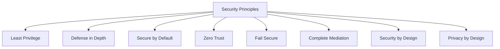
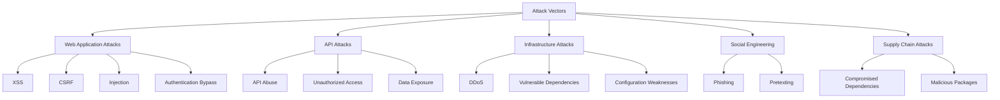
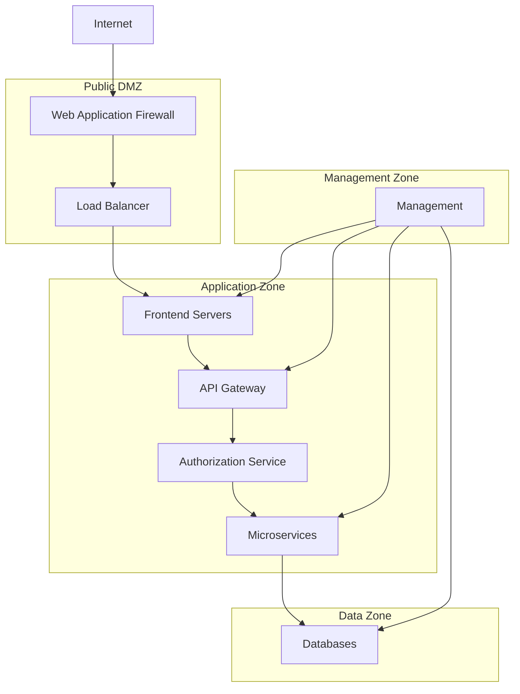
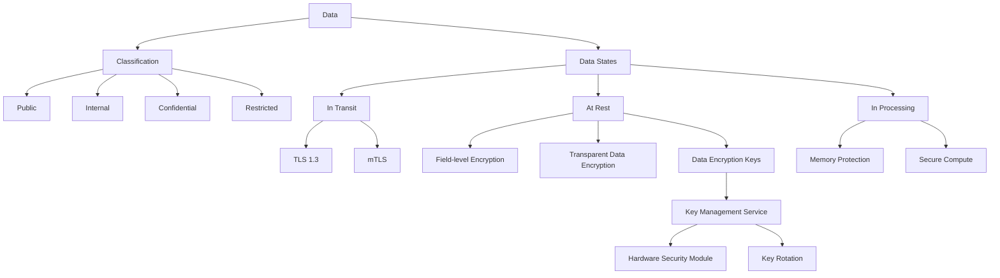
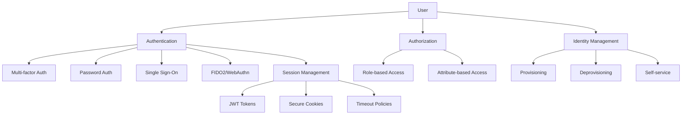
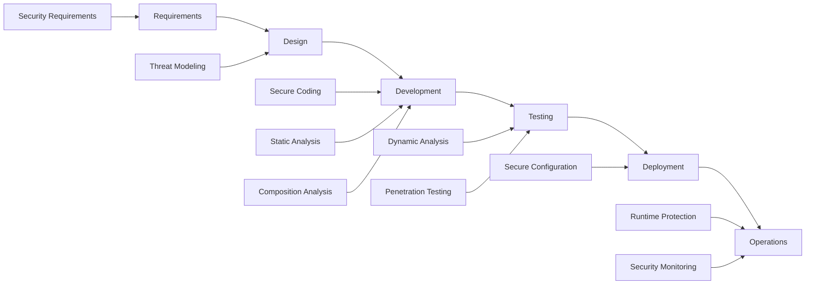

# Security Architecture Design - Phase 1

**Version:** 1.0  
**Date:** July 18, 2025  
**Author:** Farid-Ze (Tech Team)  
**Status:** Final Draft

## 1. Security Architecture Overview

The Merajut ASA platform implements a defense-in-depth security approach, incorporating multiple layers of security controls to protect user data, financial transactions, and platform integrity. This document outlines the comprehensive security architecture designed to meet regulatory requirements, industry best practices, and user trust expectations.

## 2. Security Principles

### 2.1 Core Security Principles



1. **Least Privilege**: Systems, processes, and users operate with minimal privileges needed to perform their functions
2. **Defense in Depth**: Multiple security controls at different layers create redundant protection
3. **Secure by Default**: All components start with secure configurations requiring explicit changes to reduce security
4. **Zero Trust**: All network traffic is authenticated and authorized regardless of source
5. **Fail Secure**: Systems default to secure state when failures occur
6. **Complete Mediation**: Every access to resources is checked for authorization
7. **Security by Design**: Security requirements integrated throughout the development lifecycle
8. **Privacy by Design**: Data minimization and privacy controls embedded in system architecture

### 2.2 Security Governance Framework

- **Risk Assessment Process**: Quarterly security risk assessments with documented mitigation plans
- **Security Roles & Responsibilities**: Defined RACI matrix for security functions
- **Policy Framework**: Hierarchical security policy structure from high-level principles to technical standards
- **Compliance Management**: Systematic tracking of regulatory and industry requirements
- **Incident Response Framework**: Defined procedures, roles and playbooks for security incidents

## 3. Threat Model

### 3.1 Threat Actors

| Threat Actor | Motivation | Capability | Target Assets |
|--------------|------------|------------|--------------|
| Financially Motivated Attackers | Financial gain | Medium-High | Payment information, User accounts |
| Fraudulent Campaign Creators | Financial gain | Low-Medium | Donation system |
| Malicious Insiders | Various | Medium-High | User data, Platform configuration |
| Nation State Actors | Intelligence, Disruption | High | User data, Platform availability |
| Hacktivists | Ideological | Medium | Platform reputation, Availability |
| Opportunistic Attackers | Convenience | Low | Vulnerable components |

### 3.2 Attack Vectors



### 3.3 STRIDE Threat Analysis

| Component | Spoofing | Tampering | Repudiation | Info Disclosure | Denial of Service | Elevation of Privilege |
|-----------|----------|-----------|-------------|-----------------|-------------------|------------------------|
| Authentication Service | High | Medium | Medium | High | Medium | High |
| Payment Service | High | High | High | High | High | High |
| Campaign Service | Medium | High | Medium | Medium | High | Medium |
| User Service | High | Medium | Medium | High | Medium | Medium |
| Community Service | Medium | Medium | Low | Medium | Medium | Low |
| Frontend Application | Medium | Medium | Low | Medium | High | Low |
| Database | High | High | Medium | High | High | High |
| API Gateway | Medium | Medium | Medium | Medium | High | Medium |

## 4. Security Control Architecture

### 4.1 Security Control Layers

```mermaid
graph TD
    A[Security Controls] --> B[Network Security]
    A --> C[Application Security]
    A --> D[Data Security]
    A --> E[Identity Security]
    A --> F[Endpoint Security]
    A --> G[Physical Security]
    
    B --> B1[Firewalls]
    B --> B2[WAF]
    B --> B3[DDoS Protection]
    B --> B4[Network Segmentation]
    
    C --> C1[Input Validation]
    C --> C2[Output Encoding]
    C --> C3[CSRF Protection]
    C --> C4[CSP Headers]
    C --> C5[Vulnerability Management]
    
    D --> D1[Encryption at Rest]
    D --> D2[Encryption in Transit]
    D --> D3[Data Classification]
    D --> D4[Data Loss Prevention]
    
    E --> E1[Multi-factor Auth]
    E --> E2[Role-based Access Control]
    E --> E3[Session Management]
    E --> E4[Access Reviews]
    
    F --> F1[Endpoint Protection]
    F --> F2[Device Management]
    
    G --> G1[Data Center Security]
    G --> G2[Personnel Security]
```



### 4.2 Network Security Implementation

#### 4.2.1 Perimeter Security

- **Web Application Firewall (Cloudflare)**: 
  - Rule sets for OWASP Top 10 protection
  - Rate limiting: 100 requests/min per IP for sensitive endpoints
  - Geo-blocking for high-risk countries
  - Bot detection and mitigation

- **DDoS Protection (Cloudflare)**: 
  - Layer 3/4 protection: TCP SYN flood, UDP flood, DNS amplification
  - Layer 7 protection: Application-layer attack mitigation
  - Always-on monitoring with automatic mitigation
  - Traffic analysis with ML-based anomaly detection

- **Network Firewalls**: 
  - Default-deny ruleset
  - Explicitly allowed services only
  - Stateful packet inspection
  - Logging of all blocked traffic

#### 4.2.2 Network Segmentation

- **Container Network Policies**:
  - Kubernetes network policies restricting pod-to-pod communication
  - Service mesh for encrypted service-to-service communication
  - Egress filtering for external service connections

- **VPC Architecture**:
  - Public subnet: Load balancers, bastion hosts
  - Application subnet: Application containers
  - Data subnet: Databases, caches
  - Management subnet: Monitoring, logging

- **Service Boundaries**:
  - Microservice isolation with explicit ingress/egress controls
  - Internal API gateway for service-to-service authentication
  - mTLS for all service communication

### 4.3 Application Security Implementation

#### 4.3.1 Secure Coding Practices

- **Input Validation**:
  - Server-side validation for all inputs
  - Input sanitization libraries (DOMPurify for HTML)
  - Parameterized queries for database access
  - GraphQL query depth and complexity limits

- **Output Encoding**:
  - Context-specific encoding for HTML, JavaScript, CSS, URL
  - HTML entity encoding for user-generated content
  - React's inherent XSS protection leveraged
  - Response headers to prevent MIME-type sniffing

- **Security Headers**:
  ```
  Content-Security-Policy: default-src 'self'; script-src 'self' https://trusted-cdn.com; style-src 'self' https://trusted-cdn.com; img-src 'self' https://trusted-cdn.com data:; connect-src 'self' https://api.merajutasa.id; frame-ancestors 'none'; form-action 'self';
  X-Content-Type-Options: nosniff
  X-Frame-Options: DENY
  Referrer-Policy: strict-origin-when-cross-origin
  Permissions-Policy: geolocation=(), microphone=(), camera=()
  Strict-Transport-Security: max-age=31536000; includeSubDomains; preload
  ```

- **CSRF Protection**:
  - SameSite=Strict cookies
  - Custom CSRF tokens for state-changing operations
  - Token verification on server side
  - Origin verification for sensitive operations

#### 4.3.2 Dependency Security

- **Software Composition Analysis**:
  - Daily automated scanning with OWASP Dependency Check
  - GitHub Dependabot alerts and automatic PRs
  - Version pinning for all dependencies
  - Whitelist approach to npm package installation

- **Dependency Update Process**:
  - Weekly review of security advisories
  - Prioritized patching based on CVSS score
  - Automated testing for dependency updates
  - Staged rollout for critical dependencies

#### 4.3.3 Secure DevOps

- **Secrets Management**:
  - HashiCorp Vault for secrets storage
  - Dynamic secrets generation
  - Secrets rotation every 30 days
  - No hardcoded secrets in code or configuration

- **Container Security**:
  - Minimal base images (distroless where possible)
  - Container image scanning with Trivy
  - Runtime protection with Falco
  - Non-root container execution

- **Infrastructure as Code Security**:
  - Terraform code scanning with tfsec
  - Immutable infrastructure patterns
  - Version controlled configuration
  - Least privilege IAM policies

### 4.4 Data Security Implementation

#### 4.4.1 Data Classification

| Data Category | Sensitivity | Examples | Controls |
|---------------|-------------|----------|----------|
| Public | Low | Campaign descriptions, Public profiles | No additional controls |
| Internal | Medium | Aggregated statistics, Platform metrics | Access control, encryption in transit |
| Confidential | High | User contact information, Donation amounts | Access control, encryption in transit and at rest, audit logging |
| Restricted | Very High | Payment details, Authentication credentials | Strict access control, encryption in transit and at rest, tokenization, comprehensive audit logging |

#### 4.4.2 Encryption Implementation

- **Encryption in Transit**:
  - TLS 1.3 for all external communication
  - TLS 1.3 or mTLS for all internal service communication
  - Forward secrecy with ECDHE key exchange
  - Strong cipher suites (TLS_AES_256_GCM_SHA384)
  - HSTS preloading

- **Encryption at Rest**:
  - AES-256-GCM for database encryption
  - Transparent data encryption for PostgreSQL
  - Field-level encryption for PII in MongoDB
  - Encrypted backups with separate key management
  - Encryption key rotation schedule

- **Key Management**:
  - AWS KMS for key management
  - Separation of duties for key administration
  - Automated key rotation (yearly for data encryption keys)
  - Hardware security modules for root keys
  - Key access audit logging

#### 4.4.3 Data Lifecycle Management

- **Data Minimization**:
  - Collection of only necessary data
  - Purpose-specific data collection
  - Regular review of data necessity

- **Data Retention**:
  - Transaction data: 7 years (regulatory requirement)
  - User account data: Duration of account + 90 days
  - Session data: 30 days
  - Logs: 1 year
  - Automated deletion processes

- **Data Deletion**:
  - Soft deletion with delayed hard deletion
  - Secure wiping procedures for production data
  - Certificate of destruction for decommissioned hardware
  - Data deletion verification process

### 4.5 Identity and Access Management

#### 4.5.1 Authentication Implementation

- **User Authentication**:
  - Password policies:
    - Minimum 12 characters
    - Complexity requirements (uppercase, lowercase, number, symbol)
    - Check against HaveIBeenPwned API
    - Maximum age: 180 days
  - Multi-factor authentication:
    - Required for all administrator accounts
    - Optional but encouraged for standard users
    - Required for sensitive operations (large donations, withdrawals)
    - TOTP and WebAuthn support
  - Auth0 integration with custom policies
  - Brute force protection:
    - Progressive delays
    - Account lockout after 10 failed attempts
    - Risk-based authentication challenges

- **Service Authentication**:
  - OAuth 2.0 with JWT for service-to-service authentication
  - Short-lived service tokens (max 1 hour)
  - Automatic key rotation
  - Certificate-based authentication for critical services

#### 4.5.2 Authorization Implementation

- **Role-Based Access Control**:
  - Role hierarchy:
    - Anonymous
    - Authenticated User
    - Campaign Creator
    - Community Moderator
    - Platform Administrator
    - System Administrator
  - Permission sets mapped to functional requirements
  - Least privilege principle applied to all roles
  - Regular access reviews (quarterly)

- **Attribute-Based Access Control**:
  - Context-aware authorization decisions
  - Factors considered:
    - User role
    - Resource ownership
    - Time of access
    - Access location
    - Device trust level

- **API Authorization**:
  - OAuth 2.0 scopes for API access control
  - GraphQL schema directives for field-level authorization
  - Resource-based access policies
  - JWTs with minimal necessary claims

#### 4.5.3 Session Management

- **Session Security**:
  - Secure session cookies:
    - HttpOnly flag
    - Secure flag
    - SameSite=Strict
    - Domain-specific
  - Session timeout:
    - 30 minutes of inactivity
    - 24 hours maximum lifetime
  - Session regeneration on privilege change
  - Absolute session expiration requiring re-authentication

### 4.6 Audit and Monitoring

#### 4.6.1 Security Logging

- **Log Sources**:
  - Application logs (structured JSON format)
  - Database audit logs
  - Network flow logs
  - Authentication events
  - Authorization decisions
  - API gateway access logs
  - Container logs
  - Host-level system logs

- **Log Content Standards**:
  - Timestamp (ISO 8601 format with TZ)
  - Event type/category
  - Source (service, component)
  - Actor (user, service)
  - Action
  - Resource affected
  - Result (success/failure)
  - Error codes (if applicable)
  - Correlation ID for request tracing

- **Sensitive Data Handling**:
  - No sensitive data in logs
  - PII redaction before storage
  - Tokenization of identifiers when needed
  - Access controls on log storage

#### 4.6.2 Security Monitoring

- **Real-time Monitoring**:
  - SIEM integration (ELK Stack)
  - Critical alert response: < 15 minutes
  - Dashboard visualization of security events
  - Automated correlation rules

- **Detection Capabilities**:
  - Brute force attack detection
  - Unusual access pattern detection
  - Privilege escalation detection
  - Data exfiltration detection
  - Impossible travel detection
  - Service account misuse detection

- **Alert Thresholds**:
  - Severity-based alerting
  - False positive tuning process
  - Alert aggregation for storm prevention
  - On-call rotation for alert response

#### 4.6.3 Vulnerability Management

- **Vulnerability Scanning**:
  - Daily automated infrastructure scans
  - Weekly authenticated application scans
  - Monthly penetration testing
  - Continuous dependency scanning

- **Vulnerability Handling Process**:
  - Severity assessment using CVSS
  - SLA for remediation:
    - Critical: 24 hours
    - High: 7 days
    - Medium: 30 days
    - Low: 90 days
  - Exception process with risk acceptance
  - Vulnerability tracking and metrics

### 4.7 Incident Response

#### 4.7.1 Incident Response Plan

- **Incident Classification**:
  - Level 1: Minor impact, contained
  - Level 2: Moderate impact, potential data affected
  - Level 3: Major impact, confirmed data breach
  - Level 4: Critical impact, severe business disruption

- **Response Team Structure**:
  - Incident Commander
  - Technical Lead
  - Communications Lead
  - Legal Representative
  - Executive Sponsor

- **Response Phases**:
  - Identification
  - Containment
  - Eradication
  - Recovery
  - Post-incident analysis

#### 4.7.2 Incident Response Procedures

- **Initial Response**:
  - Activation criteria
  - Notification procedures
  - Initial assessment checklist
  - Evidence preservation guidelines

- **Containment Strategies**:
  - Network isolation procedures
  - Account lockdown procedures
  - System quarantine procedures
  - Emergency access procedures

- **Communication Plan**:
  - Internal communication templates
  - Customer notification procedures
  - Regulatory reporting requirements
  - Media response guidelines

#### 4.7.3 Recovery Procedures

- **Service Restoration**:
  - Integrity verification before restoration
  - Phased service restoration approach
  - Post-restoration monitoring
  - User communication templates

- **Post-Incident Activities**:
  - Root cause analysis template
  - Lessons learned documentation
  - Control improvement tracking
  - Simulation exercises based on incidents

## 5. Compliance and Regulatory Considerations

### 5.1 Regulatory Framework

- **Indonesian Financial Regulations**:
  - OJK regulations for crowdfunding platforms
  - Bank Indonesia regulations for payment processing
  - KYC/AML requirements implementation

- **Privacy Regulations**:
  - Indonesian Personal Data Protection Law
  - Cross-border data transfer controls
  - User consent management
  - Data subject rights fulfillment

- **Industry Standards**:
  - PCI DSS for payment card handling
  - ISO 27001 alignment for ISMS
  - OWASP ASVS as security benchmark

### 5.2 Compliance Controls

- **Documentation Requirements**:
  - Security policies and procedures
  - Risk assessments
  - Control effectiveness testing
  - Third-party risk management

- **Technical Controls**:
  - Separation of duties
  - Control access to production
  - Change management procedures
  - Evidence collection automation

- **Audit Readiness**:
  - Continuous compliance monitoring
  - Evidence repository
  - Control testing schedule
  - Remediation tracking

## 6. Security Implementation Roadmap

### 6.1 Phase 1 Implementation (Current)

| Security Control | Implementation Timeline | Responsible Team | Dependencies |
|------------------|------------------------|------------------|--------------|
| WAF Implementation | Week 1-2 | Infrastructure | CDN Setup |
| Authentication Service | Week 1-4 | Identity Team | User Service |
| Data Encryption | Week 2-4 | Database Team | Schema Finalization |
| RBAC Framework | Week 3-5 | Identity Team | User Service, Auth Service |
| Security Headers | Week 1 | Frontend Team | None |
| Secure Coding Standards | Week 1 | All Teams | None |
| Vulnerability Scanning | Week 2 | Security Team | CI/CD Pipeline |
| Incident Response Plan | Week 3-4 | Security Team | None |

### 6.2 Future Security Enhancements

| Security Enhancement | Planned Timeline | Business Justification |
|----------------------|------------------|------------------------|
| Advanced Fraud Detection | Q4 2025 | Reduce financial loss from fraudulent campaigns |
| Security Orchestration and Response | Q1 2026 | Improve incident response time and effectiveness |
| Biometric Authentication | Q2 2026 | Enhance user experience while maintaining security |
| Zero Trust Network Implementation | Q3 2026 | Address evolving threat landscape for remote access |
| AI-based Threat Detection | Q4 2026 | Proactively identify novel attack patterns |

## 7. Security Architecture Diagrams

### 7.1 Network Security Architecture



### 7.2 Data Security Architecture



### 7.3 Identity Architecture



## 8. Secure Development Lifecycle

### 8.1 Security in SDLC



### 8.2 Security Testing Strategy

- **Automated Security Testing**:
  - Static Application Security Testing (SAST):
    - Tools: SonarQube, ESLint security rules
    - Frequency: On every pull request
    - Target: 0 high or critical findings
  - Dynamic Application Security Testing (DAST):
    - Tools: OWASP ZAP
    - Frequency: Daily on staging environment
    - Target: 0 high or critical findings
  - Software Composition Analysis (SCA):
    - Tools: OWASP Dependency Check, npm audit
    - Frequency: Daily and on dependency changes
    - Target: No components with high or critical vulnerabilities

- **Manual Security Testing**:
  - Code Reviews:
    - Security-focused code reviews for sensitive components
    - Pair programming for high-risk features
  - Penetration Testing:
    - Monthly internal penetration tests
    - Quarterly external penetration tests
    - Annual red team exercise
  - Threat Modeling:
    - Required for new features and architectural changes
    - STRIDE methodology
    - Attack tree analysis for critical functions

### 8.3 Security Requirements

- **Application Security Requirements**:
  - Input validation for all user-supplied data
  - Output encoding for all user-displayed data
  - Authentication for all non-public resources
  - Authorization checks for all protected operations
  - Secure error handling (no sensitive data in errors)
  - Secure default configurations
  - Protection against OWASP Top 10 vulnerabilities

- **API Security Requirements**:
  - Rate limiting for all endpoints
  - Authentication for all non-public endpoints
  - Request validation using JSON Schema
  - Response filtering based on user permissions
  - API keys with appropriate scopes
  - Audit logging for all sensitive operations
  - Versioning strategy for backward compatibility

## 9. Conclusion

This security architecture provides a comprehensive framework for protecting the Merajut ASA platform, its users, and their data. By implementing these security controls across multiple layers, we create a robust defense against various threats while maintaining the performance and usability requirements of the platform.

The security architecture is designed to be:

1. **Holistic**: Addressing security at all layers of the technology stack
2. **Practical**: Balancing security with usability and performance
3. **Scalable**: Growing with the platform's user base and feature set
4. **Compliant**: Meeting regulatory requirements for financial platforms
5. **Sustainable**: Manageable with the resources of the organization

This document serves as the foundation for security implementation across all components of the Merajut ASA platform and should be reviewed and updated quarterly to reflect changes in the threat landscape, technology stack, and regulatory environment.
```

This comprehensive security architecture design:

1. Follows a defense-in-depth approach with multiple security layers
2. Provides technical implementation details for each security control
3. Includes security diagrams for visualization of the architecture
4. Outlines implementation phases and timelines
5. Addresses regulatory requirements specific to Indonesian financial platforms
6. Establishes security testing strategies and requirements

The document is structured to fit within your existing technical architecture blueprint while providing the detailed security architecture needed for Phase 1 implementation.