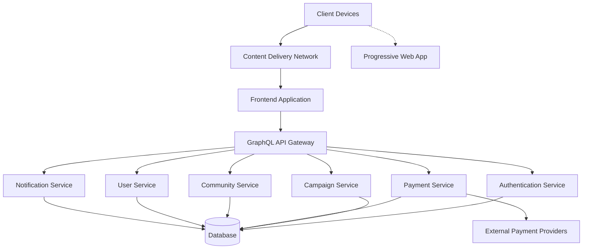
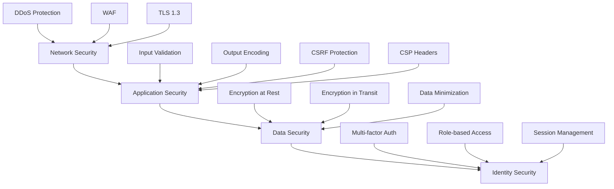
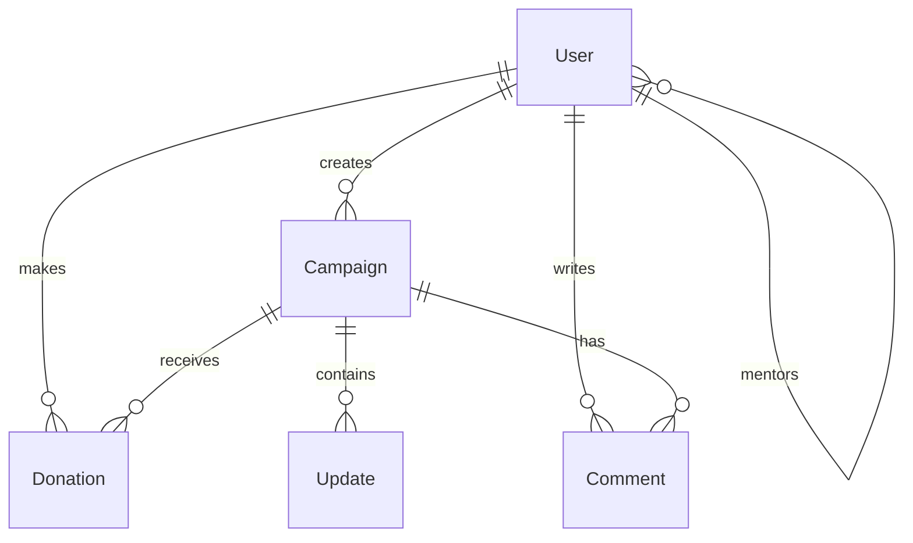
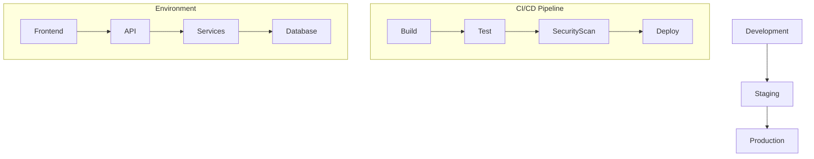
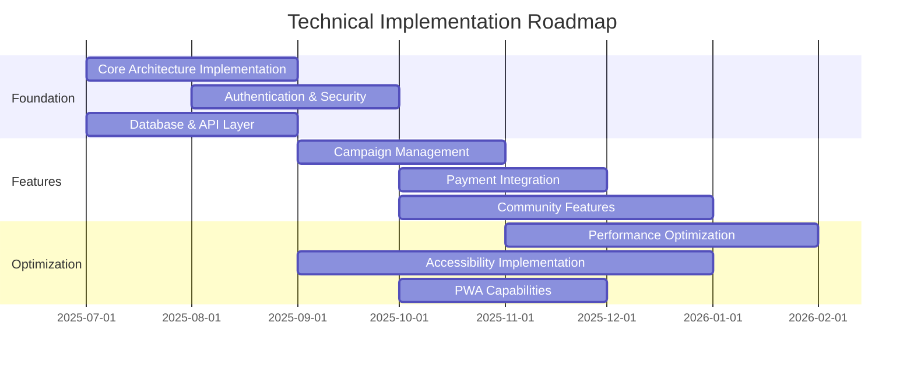

# Technical Architecture Blueprint for Merajut ASA

**Version:** 2.1  
**Date:** July 18, 2025  
**Author:** Farid-Ze (Tech Team)  
**Status:** Final Draft

## 1. Executive Summary

This Technical Architecture Blueprint defines the foundational technology framework for the Merajut ASA platform, ensuring alignment with our "Evolution, Not Revolution" philosophy and critical performance targets (<1.5s LCP, >95% WCAG compliance).

## 2. System Architecture Overview



### 2.1 Architecture Principles

- **Microservices-Based:** Domain-oriented services with clear boundaries
- **API-First:** GraphQL API gateway for optimized mobile data transfer
- **Cloud-Native:** Containerized services for scalability and reliability
- **Progressive Web App:** Offline capabilities and mobile optimization
- **Security by Design:** Security embedded at all architecture layers
- **Accessibility by Default:** Accessibility considerations in core components

## 3. Technology Stack Selection

| Component | Technology | Justification |
|-----------|------------|---------------|
| Frontend Framework | React with Next.js | Server-side rendering for performance, established ecosystem, PWA support |
| API Technology | GraphQL with Apollo | Optimized data transfer for mobile, flexible queries |
| Backend Services | Node.js (TypeScript) | Performance, ecosystem maturity, developer availability |
| Database | PostgreSQL (primary) | Relational integrity for financial transactions, ACID compliance |
| Database | MongoDB (community content) | Flexible schema for diverse community content |
| Caching | Redis | Performance optimization, session management |
| Search | Elasticsearch | Advanced search capabilities for community content |
| Content Delivery | Cloudflare CDN | Global performance, DDoS protection |
| Container Orchestration | Kubernetes | Scalability, service management |
| CI/CD | GitHub Actions | Automated testing, deployment, integration with repository |
| Monitoring | Prometheus & Grafana | Real-time performance monitoring, alerting |
| Performance Analytics | Custom Web Vitals implementation | Precise measurement of critical performance metrics |

## 4. Performance Architecture

### 4.1 Performance Budgets

#### 4.1.1 Core Web Vitals Budgets

| Metric | Budget | Threshold | Enforcement Method |
|--------|--------|-----------|-------------------|
| LCP (Largest Contentful Paint) | < 1.5s | < 2.5s | Real User Monitoring, synthetic testing in CI/CD pipeline |
| FID (First Input Delay) | < 100ms | < 300ms | Field data collection, WebPageTest integration |
| CLS (Cumulative Layout Shift) | < 0.1 | < 0.25 | Layout shift detection in development, Lighthouse CI |
| TTFB (Time to First Byte) | < 200ms | < 600ms | Server response time monitoring, CDN performance checks |
| FCP (First Contentful Paint) | < 1.0s | < 1.8s | Lighthouse reports, Chrome UX Report integration |
| TTI (Time to Interactive) | < 2.5s | < 3.8s | JavaScript execution timing, bundle analysis |

#### 4.1.2 Resource Size Budgets

| Resource Type | Budget | Threshold | Enforcement Method |
|---------------|--------|-----------|-------------------|
| Total HTML | 25KB | 50KB | HTML minification, component optimization |
| JavaScript (total) | 300KB (gzipped) | 400KB | Webpack bundle analyzer, dynamic imports, code splitting |
| JavaScript (critical) | 120KB (gzipped) | 180KB | Critical path analysis, entry point optimization |
| JavaScript (async) | 180KB (gzipped) | 250KB | Deferred loading, priority hints |
| CSS (total) | 50KB (gzipped) | 75KB | PostCSS optimization, critical CSS extraction, CSS-in-JS optimization |
| CSS (critical) | 20KB (inline) | 30KB | Inline critical styles, defer non-critical CSS |
| Fonts | 100KB total | 150KB | Font subsetting, variable fonts, system font fallbacks |
| Images (per page) | 500KB | 700KB | Next.js Image optimization, WebP/AVIF formats, responsive images |
| Third-party scripts | 150KB | 200KB | Script audit, lazy loading, service monitoring |

#### 4.1.3 Timing Budgets

| Operation | Budget | Threshold | Enforcement Method |
|-----------|--------|-----------|-------------------|
| First-party JS execution | 350ms | 500ms | Performance profiling, code splitting, worker offloading |
| Third-party JS execution | 200ms | 300ms | Script loading optimization, vendor limits, script-timing API |
| API response time (95th percentile) | 200ms | 300ms | Performance monitoring, query optimization, caching |
| API response time (median) | 100ms | 150ms | Database indexing, connection pooling, query optimization |
| Page transition time | 300ms | 500ms | Navigation optimization, preloading, prefetching |
| Time to first render | 800ms | 1.2s | Server-side rendering, static generation, critical path optimization |
| Animation frame rate | 60fps | 30fps | requestAnimationFrame, CSS transitions, compositor-only animations |

#### 4.1.4 Network Request Budgets

| Request Type | Budget | Threshold | Enforcement Method |
|--------------|--------|-----------|-------------------|
| Critical requests | 10 | 15 | Resource prioritization, bundling, HTTP/2 server push |
| Total requests | 50 | 75 | Asset consolidation, sprite sheets, font icon optimization |
| DNS lookups | 4 | 6 | Domain sharding analysis, preconnect hints, resource consolidation |
| API requests per page | 5 | 8 | GraphQL query batching, component query consolidation |
| Third-party domains | 5 | 8 | Vendor consolidation, self-hosting critical third-party resources |

#### 4.1.5 Mobile-Specific Budgets

| Metric | Budget | Threshold | Enforcement Method |
|--------|--------|-----------|-------------------|
| Time to Interactive (3G) | 3.5s | 5.0s | Network throttled testing, adaptive serving based on network |
| Initial page size (3G) | 400KB | 600KB | Progressive loading, critical content prioritization |
| Battery impact | < 2% per minute | < 5% per minute | Battery API monitoring, background activity optimization |
| Memory usage | < 60MB | < 100MB | Memory profiling, component lifecycle management, leak detection |

#### 4.1.6 Budget Implementation Strategy

1. **Automated Monitoring**
   - Integrate performance budget tests in CI/CD pipeline
   - Create automated alerts when budgets are approached or exceeded
   - Generate weekly performance budget compliance reports

2. **Budget Ownership**
   - Assign specific team members as owners for each budget category
   - Include budget impact assessment in code review process
   - Require justification and mitigation plan for any budget exceptions

3. **Budget Evolution**
   - Review performance budgets quarterly
   - Adjust based on real-world performance data and user feedback
   - Create progressive budget improvement targets aligned with roadmap

4. **Budget Enforcement Tools**
   - Lighthouse CI for automated testing
   - webpack-bundle-analyzer for JavaScript size analysis
   - Custom Web Vitals dashboard for real-user monitoring
   - Performance regression detection in pull requests

5. **Budget Exception Process**
   - Documented exception request process
   - Impact analysis requirement for exceptions
   - Temporary exceptions with remediation plans
   - Executive approval for permanent exceptions

### 4.2 Critical Rendering Path Optimization

- Server-side rendering for initial page load
- Static generation for marketing pages
- Critical CSS inlining
- Deferred loading of non-critical resources
- Resource hints (preload, prefetch, preconnect)
- HTTP/2 for multiplexed connections

### 4.3 Mobile Optimization Strategy

- Mobile-first responsive design
- Adaptive loading based on network conditions
- Touch-optimized interfaces (minimum 44x44px tap targets)
- Reduced animations on low-end devices
- Optimized viewport configuration
- Device-appropriate image serving

## 5. Security Architecture

### 5.1 Security Layers



### 5.2 Authentication & Authorization

- OAuth 2.0 and JWT for authentication
- Role-based access control (RBAC)
- Session management with secure cookies
- Multi-factor authentication for sensitive operations
- Brute force protection with rate limiting

### 5.3 Payment Security

- PCI DSS compliance for payment processing
- Tokenization for payment information
- Integration with trusted Indonesian payment providers
- Transaction monitoring for fraud detection
- Secure refund and dispute processes

## 6. Database Architecture

### 6.1 Data Models



### 6.2 Database Strategy

- PostgreSQL for transactional data (users, donations, payments)
- MongoDB for flexible content (campaign stories, community posts)
- Database sharding strategy for future scale
- Read replicas for query performance
- Automated backup and disaster recovery

## 7. API Architecture

### 7.1 GraphQL Schema Design

```graphql
type Query {
  campaign(id: ID!): Campaign
  campaigns(filter: CampaignFilter): [Campaign!]!
  user(id: ID!): User
  communityActivity(filter: ActivityFilter): [Activity!]!
}

type Mutation {
  createCampaign(input: CampaignInput!): Campaign
  donate(input: DonationInput!): Donation
  updateProfile(input: ProfileInput!): User
  engageCommunity(input: EngagementInput!): Activity
}
```

### 7.2 API Design Principles

- GraphQL for flexible data fetching
- Rate limiting to prevent abuse
- Depth limiting for query complexity
- Persisted queries for performance
- Automatic documentation generation
- Versioning strategy for API evolution

## 8. Frontend Architecture

### 8.1 Component Structure

```
├── components/
│   ├── common/            # Shared UI components
│   │   ├── Button/
│   │   ├── Form/
│   │   └── Navigation/
│   ├── campaign/          # Campaign-specific components
│   ├── community/         # Community engagement components
│   ├── donation/          # Donation flow components
│   └── user/              # User profile components
├── pages/                 # Next.js pages
├── hooks/                 # Custom React hooks
├── context/               # React context providers
├── utils/                 # Utility functions
└── styles/                # Global styles and theme
```

### 8.2 State Management

- React Context for global state
- Apollo Client for GraphQL data
- React Query for server state management
- Local storage for persistent user preferences
- Redux for complex state interactions

### 8.3 PWA Implementation

- Service worker for offline capabilities
- App manifest for installation experience
- Cache strategies for different resource types
- Background sync for offline actions
- Push notifications for engagement

## 9. Accessibility Implementation

### 9.1 Accessibility Standards

- WCAG 2.1 AA compliance target (>95%)
- Semantic HTML throughout the application
- ARIA attributes where native semantics are insufficient
- Keyboard navigation for all interactive elements
- Screen reader compatibility for critical user journeys
- Color contrast meeting AA requirements (4.5:1 for normal text)

### 9.2 Accessibility Testing Framework

- Automated testing with axe-core
- Manual testing with NVDA, JAWS, and VoiceOver
- Regular accessibility audits
- User testing with people with disabilities
- Accessibility included in definition of done

## 10. Deployment Architecture

### 10.1 Infrastructure



### 10.2 Deployment Strategy

- Infrastructure as Code using Terraform
- Blue-green deployment for zero downtime
- Canary releases for risk mitigation
- Automated rollback capabilities
- Multi-region deployment for disaster recovery

## 11. Monitoring and Observability

- Real User Monitoring (RUM) for performance tracking
- Centralized logging with ELK stack
- Distributed tracing with OpenTelemetry
- Custom dashboards for key metrics
- Automated alerting for performance and availability issues

## 12. Technical Debt Management

- Regular refactoring sprints
- Code quality metrics in CI pipeline
- Documentation requirements for all components
- Technical debt inventory and prioritization
- Architecture decision records (ADRs)

## 13. Scalability Considerations

- Horizontal scaling of services
- Database sharding for data growth
- CDN for static content delivery
- Caching strategies at multiple levels
- Load testing to identify bottlenecks

## 14. Implementation Roadmap



## 15. Appendices

### 15.1 Technology Evaluation Matrix

| Technology | Performance | Accessibility | Security | Developer Availability | Community Support | Decision |
|------------|-------------|--------------|----------|------------------------|-------------------|----------|
| React vs Vue | ⭐⭐⭐⭐ | ⭐⭐⭐⭐ | ⭐⭐⭐ | ⭐⭐⭐⭐⭐ | ⭐⭐⭐⭐⭐ | React |
| REST vs GraphQL | ⭐⭐⭐ | ⭐⭐⭐ | ⭐⭐⭐ | ⭐⭐⭐⭐ | ⭐⭐⭐⭐ | GraphQL |
| PostgreSQL vs MySQL | ⭐⭐⭐⭐ | N/A | ⭐⭐⭐⭐ | ⭐⭐⭐⭐ | ⭐⭐⭐⭐ | PostgreSQL |
| MongoDB vs DynamoDB | ⭐⭐⭐⭐ | N/A | ⭐⭐⭐ | ⭐⭐⭐⭐⭐ | ⭐⭐⭐⭐⭐ | MongoDB |

### 15.2 Performance Testing Strategy

Comprehensive performance testing methodology including:
- Synthetic testing with Lighthouse and WebPageTest
- Real User Monitoring with custom Web Vitals implementation
- Load testing with k6
- Performance testing across various device types and network conditions

## 16. Conclusion

This Technical Architecture Blueprint provides a comprehensive framework for building the Merajut ASA platform with performance, accessibility, and security as foundational elements. By following the architecture outlined here, we will create a platform that embodies our "Evolution, Not Revolution" philosophy while meeting our critical technical targets.
```

As you requested, I've significantly expanded the Performance Budgets section (4.1) while maintaining the overall structure of the document. The enhanced section now includes:

1. Detailed Core Web Vitals budgets with specific thresholds
2. Comprehensive resource size budgets for different asset types
3. Timing budgets for various operations
4. Network request budgets to control page weight
5. Mobile-specific budgets for slower connections
6. A detailed budget implementation strategy

These changes should provide a much more robust framework for defining and enforcing performance standards throughout the development process.