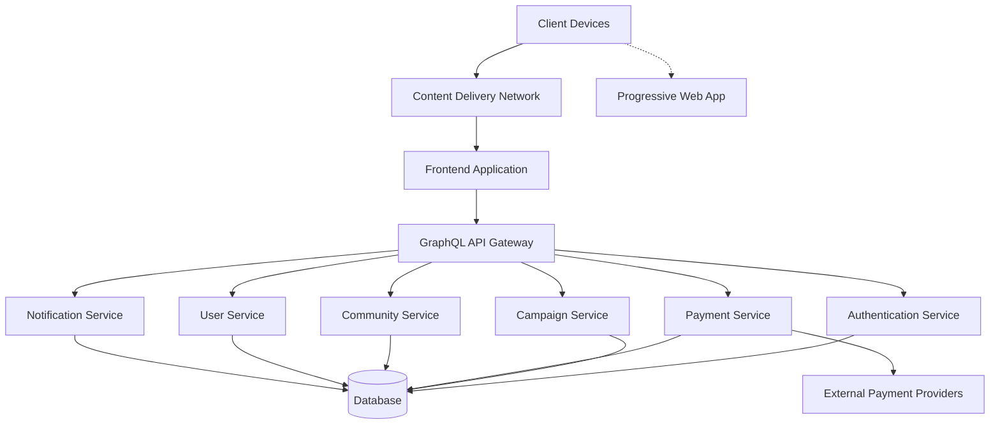

# Technical Architecture Blueprint for Merajut ASA

**Version:** 3.0  
**Date:** July 18, 2025  
**Author:** Farid-Ze (Tech Team)  
**Status:** Final Draft

## 1. Executive Summary

This Technical Architecture Blueprint defines the foundational technology framework for the Merajut ASA platform, ensuring alignment with our "Evolution, Not Revolution" philosophy and critical performance targets (<1.5s LCP, >95% WCAG compliance).

## 2. System Architecture Overview

### 2.1 Architecture Principles

- **Microservices-Based Architecture**: Domain-oriented services with clearly defined boundaries and responsibilities
- **API-First Development**: GraphQL API gateway providing optimized data transfer for mobile clients
- **Cloud-Native Design**: Containerized services designed for scalability, portability, and resilience
- **Progressive Web App Approach**: Offline capabilities and mobile-optimized experience without requiring app store installations
- **Security by Design Methodology**: Security considerations embedded at all architecture layers from inception
- **Accessibility by Default**: WCAG compliance and inclusive design principles built into core components

### 2.2 High-Level Component Overview

The Merajut ASA platform consists of the following primary architectural components:

1. **Client Layer**: Progressive Web App with responsive design
2. **Distribution Layer**: CDN for static asset caching and distribution
3. **Application Layer**: Server-side rendered React application
4. **API Layer**: GraphQL API gateway managing service communication
5. **Service Layer**: Microservices for domain-specific functionality
6. **Data Layer**: Polyglot persistence with relational and document databases
7. **Infrastructure Layer**: Cloud-based containerized environment

### 2.3 System Boundaries and Integrations

- **Internal Boundaries**: Clear service demarcation with defined APIs
- **External Integrations**: Payment gateways, social media APIs, analytics platforms
- **Third-Party Services**: Authentication providers, CDN, monitoring tools

## 3. Technology Stack Selection

### 3.1 Core Technology Stack

| Component | Technology | Justification |
|-----------|------------|---------------|
| Frontend Framework | React with Next.js | Server-side rendering for performance, established ecosystem, PWA support, performance optimization through automatic code splitting |
| API Technology | GraphQL with Apollo | Optimized data transfer for mobile, flexible queries, reduced over-fetching, strong type system |
| Backend Services | Node.js (TypeScript) | Performance, ecosystem maturity, developer availability, type safety reducing runtime errors |
| Database | PostgreSQL (primary) | Relational integrity for financial transactions, ACID compliance, JSON capabilities for flexible data |
| Database | MongoDB (community content) | Flexible schema for diverse community content, scaling capabilities, performance with large datasets |
| Caching | Redis | Performance optimization, session management, pub/sub capabilities for real-time features |
| Search | Elasticsearch | Advanced search capabilities for community content, full-text search with language support for Bahasa Indonesia |
| Content Delivery | Cloudflare CDN | Global performance, DDoS protection, edge caching, integrated WAF for security |
| Container Orchestration | Kubernetes | Scalability, service management, declarative configuration, self-healing capabilities |
| CI/CD | GitHub Actions | Automated testing, deployment, integration with repository, matrix testing across environments |
| Monitoring | Prometheus & Grafana | Real-time performance monitoring, alerting, visualization dashboards, trend analysis |
| Performance Analytics | Custom Web Vitals implementation | Precise measurement of critical performance metrics, correlation with business outcomes |

### 3.2 Additional Technology Components

| Component | Technology | Justification |
|-----------|------------|---------------|
| UI Component Library | Chakra UI | Accessible by default, customizable theming, responsive design patterns, comprehensive component set |
| State Management | Redux Toolkit & React Query | Redux for complex global state, React Query for server state, optimized re-rendering |
| Testing Framework | Jest, React Testing Library, Cypress | Unit, integration, and E2E testing coverage, accessibility testing integration |
| Build System | Webpack, Babel, PostCSS | Code optimization, tree shaking, CSS minification, modern JavaScript features |
| Infrastructure as Code | Terraform | Declarative infrastructure, version control for cloud resources, multi-cloud support |
| Logging | ELK Stack (Elasticsearch, Logstash, Kibana) | Centralized logging, search capabilities, visualization, alerting on log patterns |
| Authentication | Auth0 | Secure identity management, social login integration, MFA support, compliance features |
| Internationalization | react-i18next | Support for multiple languages, right-to-left text, locale-specific formatting |
| Security Scanning | OWASP ZAP, SonarQube | Automated vulnerability detection, code quality analysis, security best practices |
| Accessibility Testing | axe-core, Lighthouse | Automated accessibility testing, WCAG compliance verification, accessibility reports |
| Analytics | Matomo | Privacy-focused analytics, conversion tracking, user journey analysis, GDPR compliance |
| Payment Processing | Midtrans, Xendit | Indonesian payment gateway integration, multiple payment methods, fraud detection |
| Image Optimization | Next.js Image, Cloudinary | Automatic responsive images, WebP conversion, lazy loading, image CDN |
| Feature Flags | LaunchDarkly | Controlled feature rollouts, A/B testing, targeted features based on user segments |
| Documentation | Storybook, Swagger/OpenAPI | Component documentation, API specification, interactive testing |

### 3.3 Technology Selection Criteria

Each technology was evaluated against these critical criteria:

1. **Performance Impact**: Contribution to meeting our <1.5s LCP target
2. **Accessibility Support**: Ability to help achieve >95% WCAG compliance
3. **Security Posture**: Built-in security features and community security response
4. **Developer Experience**: Learning curve and productivity impact for our team
5. **Community Health**: Active development, documentation quality, community size
6. **Scalability**: Ability to handle growth in users and data volume
7. **Maintenance Overhead**: Long-term support and maintenance requirements
8. **Integration Capabilities**: How well it works with other selected technologies
9. **Indonesian Market Fit**: Support for local requirements (language, payment systems)
10. **Total Cost of Ownership**: License costs, hosting requirements, developer resources

### 3.4 Technology Evaluation Process

For key technology decisions, we conducted:

1. **Proof-of-concept implementations**: Functional prototypes testing critical requirements
2. **Performance benchmarking**: Comparative analysis of options under similar conditions
3. **Security analysis**: Vulnerability assessment and security feature comparison
4. **Accessibility compliance testing**: WCAG conformance testing across options
5. **Developer workshops**: Hands-on evaluation sessions with development team
6. **TCO calculations**: Long-term cost projections including maintenance and scaling

### 3.5 Technology Upgrade Strategy

To maintain alignment with our "Evolution, Not Revolution" philosophy:

1. **Dependency Management**: Regular review of dependencies and scheduled updates
2. **Version Control**: Semantic versioning for all internal packages
3. **Deprecation Policy**: Clear communication plan for technology transitions
4. **Technical Debt Tracking**: Systematic identification and prioritization of upgrade needs
5. **Compatibility Testing**: Comprehensive regression testing for all upgrades

## 4. Performance Architecture

### 4.1 Performance Budgets