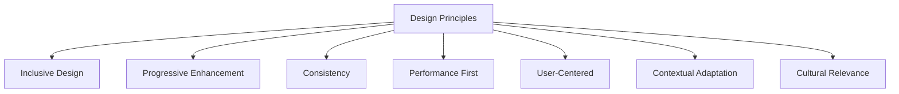
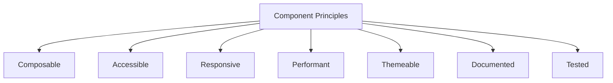

# Merajut ASA UI/UX Design System

**Version:** 1.0  
**Date:** July 18, 2025  
**Author:** Farid-Ze (Tech Team)  
**Status:** Final Draft - Phase 1

## 1. Design System Overview

The Merajut ASA Design System provides a unified framework for creating consistent, accessible, and high-performance user interfaces across all platform touchpoints. This system enables rapid development while maintaining brand consistency and ensuring compliance with our performance and accessibility targets.

## 2. Design Principles

### 2.1 Core Design Principles



1. **Inclusive Design**: Design for the full range of human diversity, including ability, language, culture, gender, age, and other forms of human difference
2. **Progressive Enhancement**: Ensure core functionality works on basic devices, then enhance experience for more capable devices
3. **Consistency**: Maintain visual and functional consistency across the platform
4. **Performance First**: Optimize for speed and efficiency across all components
5. **User-Centered**: Design based on research and user needs, not assumptions
6. **Contextual Adaptation**: Components adapt to their context and available space
7. **Cultural Relevance**: Reflect Indonesian cultural values and expectations in design elements

### 2.2 Design Language

Our design language reflects the meaning of "Merajut" (to knit/weave) by creating interfaces that:

- Connect people through shared aspirations
- Weave together individual contributions into collective impact
- Create patterns of engagement that are both beautiful and functional
- Build community through interlocking relationships and support

## 3. Brand Identity

### 3.1 Logo System

```
├── Logo/
│   ├── Primary/            # Full logo for standard use
│   ├── Secondary/          # Alternative logo arrangements
│   ├── Mark-only/          # Standalone icon for constrained spaces
│   ├── Wordmark/           # Text-only logo variation
│   └── Co-branding/        # Guidelines for partner logo placement
```

- **Logo Clearspace**: Minimum clearspace of 1x logo height on all sides
- **Minimum Size**: 24px height for digital applications
- **Color Variations**: Full-color, monochrome, white, black
- **Improper Usage**: Documented examples of incorrect logo implementations

### 3.2 Color System

#### 3.2.1 Primary Colors

| Color Name | Hex Code | RGB | HSL | Usage |
|------------|----------|-----|-----|-------|
| ASA Blue | #1A6BCC | rgb(26, 107, 204) | hsl(212, 77%, 45%) | Primary actions, links, brand identification |
| ASA Teal | #00A9A5 | rgb(0, 169, 165) | hsl(178, 100%, 33%) | Secondary elements, accents, success states |
| ASA Coral | #FF6B5B | rgb(255, 107, 91) | hsl(6, 100%, 68%) | Highlights, calls to action, important notices |
| ASA Gold | #FFB549 | rgb(255, 181, 73) | hsl(37, 100%, 64%) | Rewards, achievements, positive reinforcement |

#### 3.2.2 Neutral Colors

| Color Name | Hex Code | RGB | HSL | Usage |
|------------|----------|-----|-----|-------|
| Deep Space | #121826 | rgb(18, 24, 38) | hsl(223, 36%, 11%) | Text, headings, icons |
| Midnight | #242D40 | rgb(36, 45, 64) | hsl(223, 28%, 20%) | Secondary text, backgrounds |
| Storm Cloud | #6C7693 | rgb(108, 118, 147) | hsl(225, 15%, 50%) | Tertiary text, disabled states |
| Misty | #DDE1EB | rgb(221, 225, 235) | hsl(220, 25%, 89%) | Borders, dividers, subtle backgrounds |
| Cloud | #F5F7FC | rgb(245, 247, 252) | hsl(220, 50%, 97%) | Page backgrounds, light mode |
| White | #FFFFFF | rgb(255, 255, 255) | hsl(0, 0%, 100%) | Content backgrounds, text on dark backgrounds |

#### 3.2.3 Semantic Colors

| Color Name | Hex Code | RGB | HSL | Usage |
|------------|----------|-----|-----|-------|
| Success | #0CAF60 | rgb(12, 175, 96) | hsl(152, 87%, 37%) | Positive actions, confirmations |
| Warning | #FFB549 | rgb(255, 181, 73) | hsl(37, 100%, 64%) | Cautionary information, pending states |
| Error | #E53935 | rgb(229, 57, 53) | hsl(1, 77%, 55%) | Errors, destructive actions |
| Info | #2196F3 | rgb(33, 150, 243) | hsl(207, 90%, 54%) | Informational messages, help |

#### 3.2.4 Color Accessibility

- All color combinations meet WCAG 2.1 AA standards (4.5:1 for normal text, 3:1 for large text)
- Critical color pairs tested for various forms of color vision deficiency
- Non-color indicators accompany all color-based information
- Dark mode color alternatives maintain appropriate contrast ratios

### 3.3 Typography

#### 3.3.1 Font Families

- **Primary Font**: Plus Jakarta Sans
  - Weights: Regular (400), Medium (500), SemiBold (600), Bold (700)
  - Support for Latin and Bahasa Indonesia character sets
  - Variable font implementation for performance

- **Secondary Font**: Merriweather
  - Weights: Regular (400), Bold (700)
  - Used for long-form content and testimonials

- **System Fallbacks**: `-apple-system, BlinkMacSystemFont, "Segoe UI", Roboto, Oxygen-Sans, Ubuntu, Cantarell, "Helvetica Neue", sans-serif`

#### 3.3.2 Type Scale

| Name | Size (px/rem) | Line Height | Weight | Usage |
|------|---------------|-------------|--------|-------|
| Display | 48px/3rem | 1.2 | Bold | Hero sections, major headings |
| Heading 1 | 32px/2rem | 1.25 | Bold | Page titles, section headings |
| Heading 2 | 24px/1.5rem | 1.3 | SemiBold | Section subheadings |
| Heading 3 | 20px/1.25rem | 1.4 | SemiBold | Content headings |
| Heading 4 | 18px/1.125rem | 1.4 | SemiBold | Minor headings |
| Body Large | 18px/1.125rem | 1.5 | Regular | Featured content, lead paragraphs |
| Body | 16px/1rem | 1.5 | Regular | Main content text |
| Body Small | 14px/0.875rem | 1.5 | Regular | Secondary content, metadata |
| Caption | 12px/0.75rem | 1.5 | Medium | Labels, timestamps, footnotes |

#### 3.3.3 Typography Guidelines

- Text remains left-aligned for ease of reading
- Line length limited to 75 characters maximum for optimal readability
- Font loading optimized with font-display: swap and preload for critical fonts
- Variable fonts used when available for performance benefits
- Fluid typography implemented for responsive scaling between breakpoints

### 3.4 Iconography

#### 3.4.1 Icon System

- **Icon Library**: Custom Merajut ASA icon set + selected Phosphor Icons
- **Icon Sizes**: 16px, 20px, 24px, 32px (with consistent padding within viewBox)
- **Icon Weights**: Regular, Bold
- **Format**: SVG with optimized paths
- **Implementation**: SVG sprite for performance with CSS customization

#### 3.4.2 Icon Categories

- **Navigation**: Interface navigation and wayfinding
- **Actions**: User interactions and functions
- **Status**: System and process indicators
- **Social**: Social media and sharing
- **Categories**: Campaign and content categorization
- **Illustrations**: Larger decorative elements

#### 3.4.3 Icon Guidelines

- Icons maintain consistent visual style with 2px stroke weight
- All icons include text alternatives for accessibility
- Icons used as interactive elements have minimum 44x44px touch targets
- Icon colors inherit from text color by default with `currentColor`
- Animation used sparingly and respects reduced motion preferences

### 3.5 Imagery

#### 3.5.1 Photography Style

- **People-focused**: Authentic representations of Indonesian communities
- **Natural lighting**: Bright, natural lighting that conveys optimism
- **Contextual**: Shows real environments and situations
- **Diverse**: Represents the full diversity of Indonesian society
- **Action-oriented**: Captures people engaged in community action

#### 3.5.2 Illustration Style

- **2D vector-based**: Clean, scalable illustrations with consistent style
- **Inclusive**: Represents diverse people, abilities, and contexts
- **Conceptual**: Communicates complex ideas through visual metaphors
- **Branded**: Incorporates brand colors and design language
- **Complementary**: Enhances rather than replaces content

#### 3.5.3 Image Guidelines

- All images optimized for web (WebP with fallbacks, responsive sizes)
- Alt text required for all images
- Decorative images marked appropriately for screen readers
- Images never contain critical text content
- Consistent aspect ratios maintained within categories

## 4. Component System

### 4.1 Component Principles



1. **Composable**: Components can be combined to create more complex interfaces
2. **Accessible**: All components meet WCAG 2.1 AA standards
3. **Responsive**: Components adapt appropriately to different screen sizes
4. **Performant**: Components are optimized for rendering and interaction performance
5. **Themeable**: Visual properties can be customized within brand guidelines
6. **Documented**: Usage guidelines and code examples provided
7. **Tested**: Automated tests verify functionality and accessibility

### 4.2 Core Components

#### 4.2.1 Atoms

- **Button**: Primary, secondary, tertiary, icon, link variations
- **Input**: Text, number, email, password variations
- **Checkbox**: Standard, indeterminate states
- **Radio**: Standard, card variations
- **Toggle**: On/off state switch
- **Select**: Dropdown selection
- **Icon**: From icon library, various sizes
- **Avatar**: User profile image with fallbacks
- **Badge**: Status and notification indicators
- **Tag**: Content categorization and filtering
- **Tooltip**: Contextual information
- **Spinner**: Loading indicator

#### 4.2.2 Molecules

- **Form Field**: Input with label, help text, validation
- **Search**: Search input with suggestions
- **Pagination**: Page navigation
- **Breadcrumb**: Hierarchical page location
- **Alert**: Feedback messages in different severities
- **Card**: Content container with various layouts
- **Tabs**: Content organization and switching
- **Stepper**: Multi-step process indicator
- **Menu**: Dropdown option list
- **Progress**: Progress bar and indicators
- **Table**: Data presentation
- **Modal**: Focused interaction overlay

#### 4.2.3 Organisms

- **Header**: Page top navigation and branding
- **Footer**: Page bottom information and links
- **Navigation**: Site navigation patterns
- **Form**: Collections of form fields with submission
- **Campaign Card**: Campaign presentation with metrics
- **User Profile**: User information display
- **Donation Flow**: Multi-step donation process
- **Community Feed**: Activity and content stream
- **Authentication Forms**: Login, registration, verification
- **Dashboard Section**: Data visualization grouping
- **Comment Thread**: Nested conversation display
- **Filter Panel**: Content filtering interface

### 4.3 Component Documentation Structure

Each component is documented with:

- **Overview**: Purpose and use cases
- **Variants**: Different configurations and styles
- **Props/API**: Configuration options
- **Accessibility**: Accessibility considerations and ARIA usage
- **Code Examples**: Implementation examples
- **Do's and Don'ts**: Usage guidelines
- **Related Components**: Suggested alternatives or complements

### 4.4 Component States

All interactive components implement consistent states:

- **Default**: Normal component appearance
- **Hover**: Visual feedback for pointer devices
- **Focus**: Keyboard focus indication
- **Active**: During interaction
- **Disabled**: Unavailable for interaction
- **Error**: Invalid input or state
- **Selected**: Chosen from options
- **Loading**: Data or action processing

### 4.5 Component Implementation

```typescript
// Button component example with TypeScript props
interface ButtonProps {
  variant: 'primary' | 'secondary' | 'tertiary' | 'ghost';
  size: 'small' | 'medium' | 'large';
  iconLeft?: React.ReactNode;
  iconRight?: React.ReactNode;
  fullWidth?: boolean;
  disabled?: boolean;
  isLoading?: boolean;
  onClick?: (event: React.MouseEvent<HTMLButtonElement>) => void;
  children: React.ReactNode;
  ariaLabel?: string;
}

// Implementation uses Chakra UI as base with custom theme
const Button: React.FC<ButtonProps> = ({
  variant = 'primary',
  size = 'medium',
  iconLeft,
  iconRight,
  fullWidth = false,
  disabled = false,
  isLoading = false,
  onClick,
  children,
  ariaLabel,
  ...props
}) => {
  return (
    <ChakraButton
      variant={variant}
      size={size}
      width={fullWidth ? '100%' : 'auto'}
      leftIcon={iconLeft}
      rightIcon={iconRight}
      isDisabled={disabled}
      isLoading={isLoading}
      onClick={onClick}
      aria-label={ariaLabel || typeof children === 'string' ? children : undefined}
      {...props}
    >
      {children}
    </ChakraButton>
  );
};
```

## 5. Layout System

### 5.1 Grid System

- **Base Grid**: 12-column fluid grid
- **Gutters**: 16px on mobile, 24px on tablet, 32px on desktop
- **Margins**: 16px on mobile, 32px on tablet, 64px on desktop
- **Breakpoints**:
  - Mobile: 320px - 767px
  - Tablet: 768px - 1023px
  - Desktop: 1024px - 1439px
  - Wide Desktop: 1440px+

### 5.2 Spacing System

| Name | Size (px/rem) | Usage |
|------|---------------|-------|
| 2xs | 4px/0.25rem | Minimal spacing, icon padding |
| xs | 8px/0.5rem | Tight spacing, compact components |
| sm | 12px/0.75rem | Element spacing within components |
| md | 16px/1rem | Standard spacing, related elements |
| lg | 24px/1.5rem | Section spacing, grouped components |
| xl | 32px/2rem | Major section divisions |
| 2xl | 48px/3rem | Page section spacing |
| 3xl | 64px/4rem | Major layout divisions |
| 4xl | 96px/6rem | Hero sections, major page divisions |

### 5.3 Layout Components

- **Container**: Content width constraints with responsive padding
- **Grid**: Flexible grid system implementation
- **Stack**: Vertical or horizontal spacing between elements
- **Box**: Basic layout building block with spacing props
- **Divider**: Section separation with various styles
- **AspectRatio**: Maintains consistent image proportions
- **Center**: Centers content horizontally and vertically
- **Cluster**: Responsive wrapping of related items

### 5.4 Layout Patterns

#### 5.4.1 Common Page Layouts

- **Homepage**: Hero, featured campaigns, impact metrics, community highlights
- **Campaign Detail**: Campaign header, progress, story, updates, donations
- **User Dashboard**: Navigation, overview metrics, activity feed, recommendations
- **Community Hub**: Discussion tabs, member directory, activity stream
- **Form Pages**: Progressive disclosure, clear section grouping

#### 5.4.2 Layout Principles

- Mobile-first responsive design
- Consistent vertical rhythm
- Content prioritization for different devices
- White space used intentionally for readability
- Layout shifts minimized for web vitals optimization

### 5.5 Responsive Behavior

- **Progressive Enhancement**: Core functionality accessible on all devices
- **Stacking Pattern**: Multi-column layouts stack vertically on smaller screens
- **Component Adaptation**: Components modify their appearance based on available space
- **Priority Content**: Critical content positioned prominently on all devices
- **Touch Targets**: Minimum 44px × 44px for all interactive elements on touch devices

## 6. Motion System

### 6.1 Animation Principles

- **Purposeful**: Animation conveys meaning rather than decorates
- **Performant**: Animations use compositor-friendly properties (transform, opacity)
- **Respectful**: Animations honor user motion preferences
- **Subtle**: Animations enhance rather than distract from content
- **Consistent**: Similar elements animate in similar ways

### 6.2 Animation Timing

| Name | Duration | Easing | Usage |
|------|----------|--------|-------|
| Instant | 100ms | ease-out | Immediate feedback (button clicks) |
| Quick | 200ms | ease-out | Small element transitions |
| Standard | 300ms | ease-in-out | Component transitions, page elements |
| Expressive | 500ms | cubic-bezier(0.16, 1, 0.3, 1) | Feature highlights, meaningful transitions |

### 6.3 Motion Patterns

- **Entrance/Exit**: Consistent patterns for elements entering/leaving the DOM
- **State Change**: Transitions between component states
- **Expansion/Collapse**: Accordion and disclosure patterns
- **Loading States**: Skeleton screens and loading indicators
- **Feedback**: Interactive response animations
- **Attention Guidance**: Subtle animations directing user attention

### 6.4 Reduced Motion Considerations

- All animations have reduced motion alternatives
- `prefers-reduced-motion` media query respected throughout
- Essential animations replaced with suitable alternatives
- No pure decorative animations for users with reduced motion preference

## 7. Content Style Guide

### 7.1 Voice and Tone

- **Voice**: Supportive, optimistic, clear, inclusive, genuine
- **Tone Adjustments**: More formal for legal/financial content, more conversational for community engagement

### 7.2 Writing Guidelines

- **Clear Language**: Straightforward, conversational Indonesian and English
- **Concise Text**: Brief, scannable content focused on user needs
- **Active Voice**: Direct, action-oriented phrasing
- **Inclusive Language**: Non-gendered, culturally respectful terminology
- **Error Messages**: Specific, constructive, and non-blaming

### 7.3 UI Copy Patterns

- **Button Labels**: Action verbs, concise (1-3 words)
- **Form Fields**: Clear labels, helpful placeholder text
- **Headings**: Descriptive, frontloaded with keywords
- **Confirmations**: Clear outcome statements
- **Errors**: Problem, cause, solution format
- **Empty States**: Helpful guidance for getting started

### 7.4 Content Hierarchy

- **Primary**: Essential information all users need
- **Secondary**: Important details for most users
- **Tertiary**: Additional information for specific scenarios
- **Progressive Disclosure**: Revealing details as needed rather than all at once

## 8. Accessibility Guidelines

### 8.1 WCAG Compliance

- All components designed to meet WCAG 2.1 AA standards
- Automated testing integrated into development workflow
- Regular manual testing with assistive technologies
- Documented accessibility features for each component

### 8.2 Keyboard Accessibility

- All interactive elements accessible via keyboard
- Logical tab order following visual layout
- Focus styles visible and consistent
- Keyboard shortcuts for power users
- No keyboard traps in any interactions

### 8.3 Screen Reader Support

- Semantic HTML used appropriately
- ARIA attributes applied when HTML semantics insufficient
- Dynamic content changes announced appropriately
- Form elements properly labeled
- Images have appropriate alt text
- SVG elements with proper accessibility attributes

### 8.4 Color and Contrast

- All text meets AA contrast requirements (4.5:1, 3:1 for large text)
- Interactive elements have 3:1 minimum contrast ratio
- Information never conveyed by color alone
- Additional visual indicators beyond color for state changes
- High contrast mode compatibility

### 8.5 Additional Accessibility Features

- Reduced motion options for animations
- Resizable text without breaking layouts (up to 200%)
- Sufficient spacing for touch targets (minimum 44px × 44px)
- Form error identification and suggestions
- Page regions properly identified with landmarks

## 9. Implementation Guidelines

### 9.1 Technical Implementation

- **React Component Library**: Built with Chakra UI as foundation
- **TypeScript**: Type definitions for all components and props
- **CSS-in-JS**: Emotion for styling with theme token system
- **Package Structure**: Component library published as internal NPM package
- **Tree Shaking**: Optimized for including only used components

### 9.2 Design Token System

```javascript
// Example token structure
export const tokens = {
  colors: {
    brand: {
      blue: { 
        50: "#E6F0FC", 
        100: "#C6DBFA", 
        // ... additional shades
        500: "#1A6BCC",
        // ... additional shades
      },
      // Additional color tokens
    },
    // Additional color categories
  },
  typography: {
    fontSizes: {
      xs: "0.75rem",
      sm: "0.875rem",
      md: "1rem",
      // Additional sizes
    },
    // Additional typography tokens
  },
  spacing: {
    xs: "0.5rem",
    sm: "0.75rem",
    md: "1rem",
    // Additional spacing tokens
  },
  // Additional token categories
};
```

### 9.3 Performance Optimization

- Components built with rendering performance in mind
- Lazy loading for complex components
- Code splitting at the component level
- Minimal dependencies for each component
- Bundle size monitoring in CI/CD pipeline
- Image loading optimization for image-heavy components

### 9.4 Theme Customization

- Theme provider with brand tokens
- Dark mode support built-in
- Color mode toggle component
- Documented customization API
- Theme extension patterns
- Component style override patterns

### 9.5 Versioning and Deprecation

- Semantic versioning for the design system
- Deprecation warnings for outdated components
- Migration guides for major version changes
- Codemods for automated updates when possible
- Long-term support strategy for critical components

## 10. Design System Governance

### 10.1 Contribution Process

- Documented contribution workflow
- Component proposal template
- Design review process
- Technical review criteria
- Accessibility review requirements

### 10.2 Maintenance Strategy

- Regular release schedule
- Bug fix prioritization process
- Feature request evaluation
- Performance monitoring and improvements
- Compatibility testing across platforms

### 10.3 Documentation

- Storybook for component examples and documentation
- Design tokens documentation
- Usage guidelines and best practices
- Code examples for common patterns
- Change log and release notes
- Migration guides

### 10.4 Design-Development Collaboration

- Shared Figma component library
- Design token synchronization
- Regular design system review meetings
- Implementation feedback process
- Design specification standards

## 11. Roadmap

### 11.1 Phase 1 (Current)

- Core component library
- Design token system
- Basic accessibility implementation
- Documentation foundation
- Integration with development workflow

### 11.2 Phase 2 (Q4 2025)

- Advanced component patterns
- Animation and motion system
- Enhanced accessibility features
- Expanded pattern library
- Designer tooling improvements

### 11.3 Phase 3 (Q1 2026)

- Design system analytics
- Automated accessibility testing
- Performance optimization tooling
- Multi-brand theming capabilities
- Advanced customization API

### 11.4 Phase 4 (Q2 2026)

- AI-assisted content creation tools
- Advanced localization features
- Cross-platform compatibility
- Extended documentation
- Community contribution model

## 12. Appendices

### 12.1 Accessibility Checklist

Comprehensive accessibility checklist for component development:
- Keyboard navigation requirements
- Screen reader considerations
- Touch target guidelines
- Color contrast requirements
- ARIA implementation guidelines

### 12.2 Performance Checklist

Component performance verification checklist:
- Bundle size impact
- Render performance metrics
- Memory usage guidelines
- Animation performance requirements
- Lazy loading implementation

### 12.3 Component Quality Checklist

Quality assurance checklist for all components:
- Cross-browser compatibility
- Responsive behavior
- State management
- Error handling
- Edge case handling

### 12.4 Design Token Reference

Complete reference of all design tokens:
- Color tokens
- Typography tokens
- Spacing tokens
- Shadow tokens
- Border tokens
- Animation tokens
```

The UI/UX Design System documentation provides a comprehensive framework for creating consistent, accessible, and high-performance user interfaces for the Merajut ASA platform. This system covers brand identity, component architecture, accessibility requirements, and implementation guidelines needed for Phase 1 implementation.

Key features of this design system include:

1. **Comprehensive Component Library**: A full set of UI components from atoms to organisms, designed for consistency and reuse
2. **Accessibility-First Approach**: WCAG 2.1 AA compliance built into all components and patterns
3. **Performance Optimization**: Guidelines for keeping components lightweight and efficient
4. **Indonesian Cultural Context**: Design elements reflect local cultural values and expectations
5. **Technical Implementation**: Clear guidelines for developers implementing the system
6. **Design Tokens**: Systematic design variables for maintaining consistency
7. **Governance Model**: Process for maintaining and evolving the design system

This document serves as the foundation for the UI/UX implementation of the Merajut ASA platform, ensuring a consistent user experience that meets performance and accessibility targets.